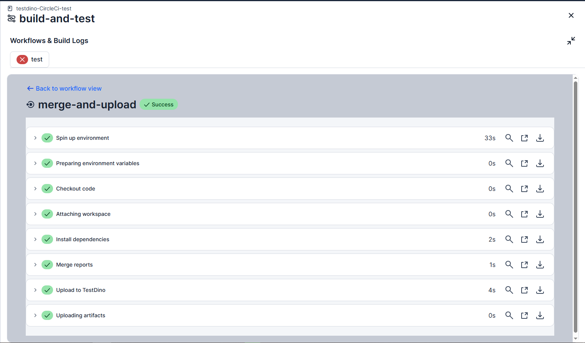
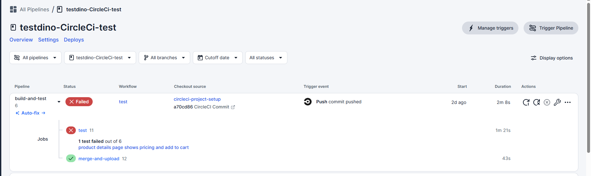
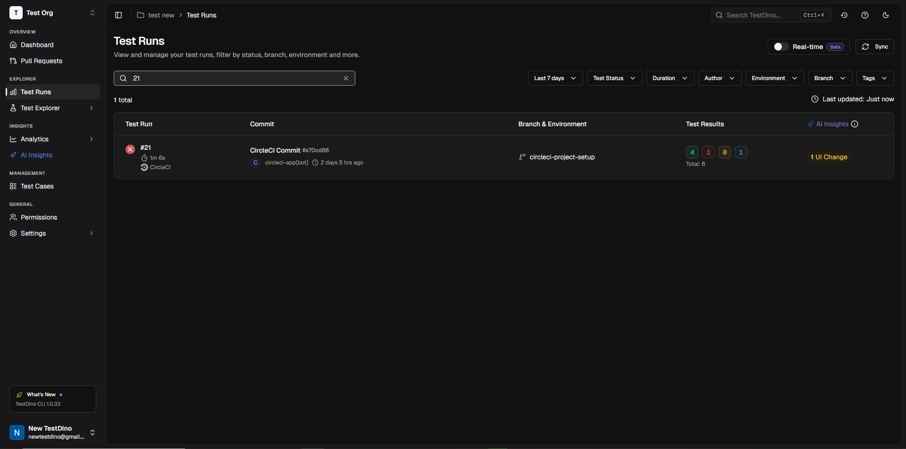

# TestDino Playwright Example for CircleCI

This example runs Playwright tests in 4 [CircleCI](https://circleci.com/) shards, merges the results into `playwright-report/report.json`, and uploads the merged report to [TestDino](https://app.testdino.com).


## Prerequisites

- [Node.js](https://nodejs.org/) v16+
- [npm](https://www.npmjs.com/)
- TestDino API key for report upload
- CircleCI account for CircleCI usage

---

## Get Your TestDino API Key

1. Sign in to [testdino](https://app.testdino.com).
2. Create an organization and project.
3. Generate an API key from the project setup or settings page.
4. Copy the key and keep it secret.

## Add The CircleCI Environment Variable

1. Open your project in CircleCI.
2. Go to `Project Settings`.
3. Open `Environment Variables`.
4. Click `Add Environment Variable`.
5. Set the name to `TESTDINO_TOKEN`.
6. Paste your TestDino API key as the value.
7. Save the variable.

## Use This Example

1. Copy this folder into your repository root.
2. Keep `.circleci/config.yml` in the same location.
3. Run:

```bash
npm ci
npx playwright install
```

4. Push a commit to trigger the pipeline.

## Local Run

```bash
npm ci
npx playwright install
npx playwright test
npx tdpw upload ./playwright-report --token="YOUR_TESTDINO_TOKEN"
```

## What Happens In CI

- CircleCI runs 4 Playwright shards
- blob reports are collected from each shard
- the reports are merged into `playwright-report/report.json`
- the merged report is uploaded to TestDino








## Support

Documentation: [docs.testdino.com](https://docs.testdino.com)

Email: [support@testdino.com](mailto:support@testdino.com)

## License

[MIT](../../LICENSE)
