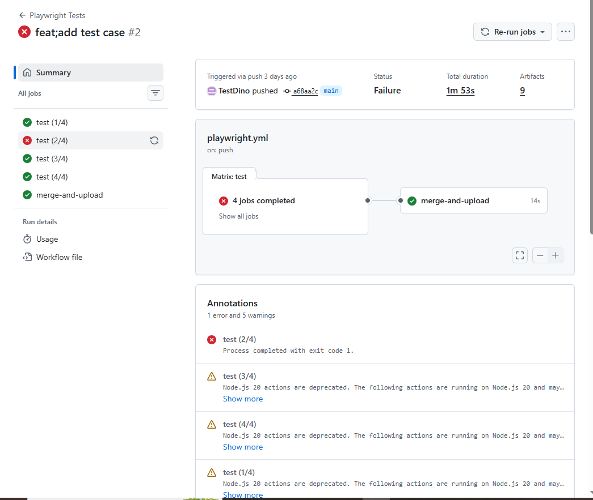

# TestDino Playwright Example for GitHub Actions

This example runs Playwright tests in 4 [GitHub Actions](https://github.com/features/actions) shards, merges the results into `playwright-report/report.json`, and uploads the merged report to [TestDino](https://app.testdino.com).

## Prerequisites

- [Node.js](https://nodejs.org/) v16+
- [npm](https://www.npmjs.com/)
- TestDino API key for report upload
- GitHub account for GitHub Actions usage

---

## Get Your TestDino API Key

1. Sign in to [testdino](https://app.testdino.com).
2. Create an organization and project.
3. Generate an API key from the project setup or settings page.
4. Copy the key and keep it secret.

## Add The GitHub Secret

1. Go to `Settings` -> `Secrets and variables` -> `Actions`.
2. Create a repository secret named `TESTDINO_TOKEN`.
3. Paste your TestDino API key.

## Use This Example

1. Copy this folder into your repository root.
2. Keep `.github/workflows/playwright.yml` in the same location.
3. Run:

```bash
npm ci
npx playwright install
```

4. Push a commit or open a pull request.

## Local Run

```bash
npm ci 
npx playwright install
npx playwright test
npx tdpw upload ./playwright-report --token="YOUR_TESTDINO_TOKEN"
```

## What Happens In CI

- GitHub Actions runs 4 Playwright shards
- blob reports are uploaded from each shard
- the reports are merged into `playwright-report/report.json`
- the merged report is uploaded to TestDino




## Support

Documentation: [docs.testdino.com](https://docs.testdino.com)

Email: [support@testdino.com](mailto:support@testdino.com)

## License

[MIT](../../LICENSE)
