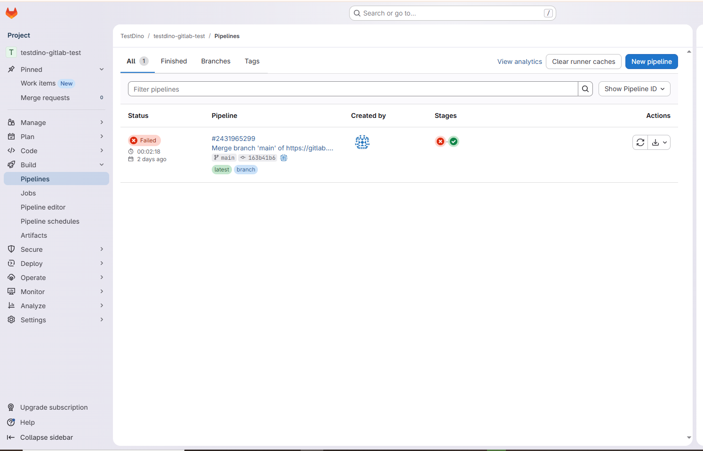
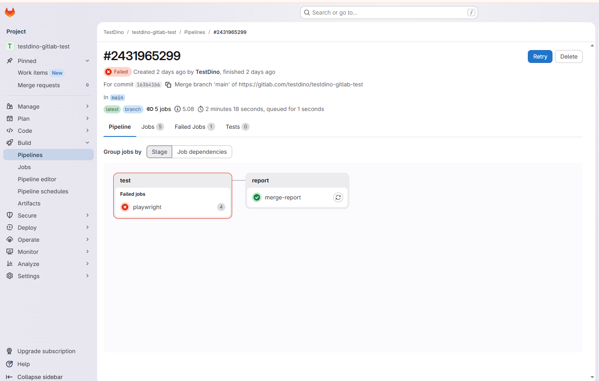
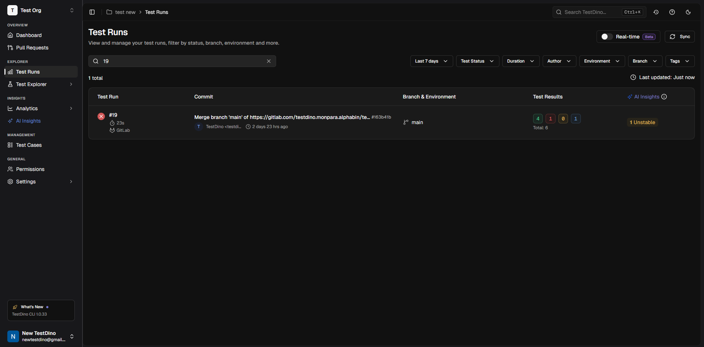

# TestDino Playwright Example for GitLab CI

This example runs Playwright tests in 4 [GitLab CI/CD](https://about.gitlab.com/) shards, merges the results into `playwright-report/report.json`, and uploads the merged report to [TestDino](https://app.testdino.com).


## Prerequisites

- [Node.js](https://nodejs.org/) v16+
- [npm](https://www.npmjs.com/)
- TestDino API key for report upload
- GitLab account for GitLab CI/CD usage

---

## Get Your TestDino API Key

1. Sign in to [testdino](https://app.testdino.com).
2. Create an organization and project.
3. Generate an API key from the project setup or settings page.
4. Copy the key and keep it secret.

## Add The GitLab CI/CD Variable

1. Go to your GitLab project.
2. Open `Settings` -> `CI/CD`.
3. Expand `Variables`.
4. Create a variable named `TESTDINO_TOKEN`.
5. Paste your TestDino API key.

## Use This Example

1. Copy this folder into your repository root.
2. Keep `.gitlab-ci.yml` at the repository root.
3. Run:

```bash
npm ci
npx playwright install
```

4. Push a commit or run the pipeline from GitLab.

## Local Run

```bash
npm ci
npx playwright install
npx playwright test
npx tdpw upload ./playwright-report --token="YOUR_TESTDINO_TOKEN"
```

## What Happens In CI

- GitLab CI/CD runs 4 Playwright shards
- blob reports are collected from each shard
- the reports are merged into `playwright-report/report.json`
- the merged report is uploaded to TestDino








## Support

Documentation: [docs.testdino.com](https://docs.testdino.com)

Email: [support@testdino.com](mailto:support@testdino.com)

## License

[MIT](../../LICENSE)
